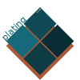

# Plating


[](https://github.com/plating-rust/plating/actions)
[](https://plating-rust.github.io/)
[](https://docs.rs/plating/)
[](https://codecov.io/gh/plating-rust/plating)

## Usage
Plating is a rust library. Add the following to your cargo.toml
```toml
[dependencies]
plating = "0.0.1"
```

## The Name

> "Plating is a surface covering in which a metal is deposited on a conductive surface." - [Wikipedia](https://en.wikipedia.org/wiki/Plating)

Pretty Technical, but it means we use Plating for:
- *"decorating objects"* (UI)
- *"corrosion inhibition"* (RUST)

There you have it: *****PLATING is the UI for RUST*****

## Philosophy
TODO:

## Library

There are a few books to help you on your journey with plating.

### [The book of Usage](TODO)
Your best way into plating. While the [documentation]() is a great place to look up specific APIs, this is the best way to start and learn the basic concepts and best practices of using plating.

### The book of internal Concepts
Once you're familiar with how to use plating, it's time to have a look behind the curtain and find out how plating actually works.

Whether you like the concepts and want to use them on your own cross-platform library, you want to push the boundaries on what you can get out of plating as a user or you chose the noble quest on helping out to improve plating itself,

### The book of Commitments


## License

Licensed under either of

 * Apache License, Version 2.0
   ([LICENSE-APACHE](LICENSE-APACHE) or http://www.apache.org/licenses/LICENSE-2.0)
 * MIT license
   ([LICENSE-MIT](LICENSE-MIT) or http://opensource.org/licenses/MIT)

at your option.

## Contribution

Unless you explicitly state otherwise, any contribution intentionally submitted
for inclusion in the work by you, as defined in the Apache-2.0 license, shall be
dual licensed as above, without any additional terms or conditions.